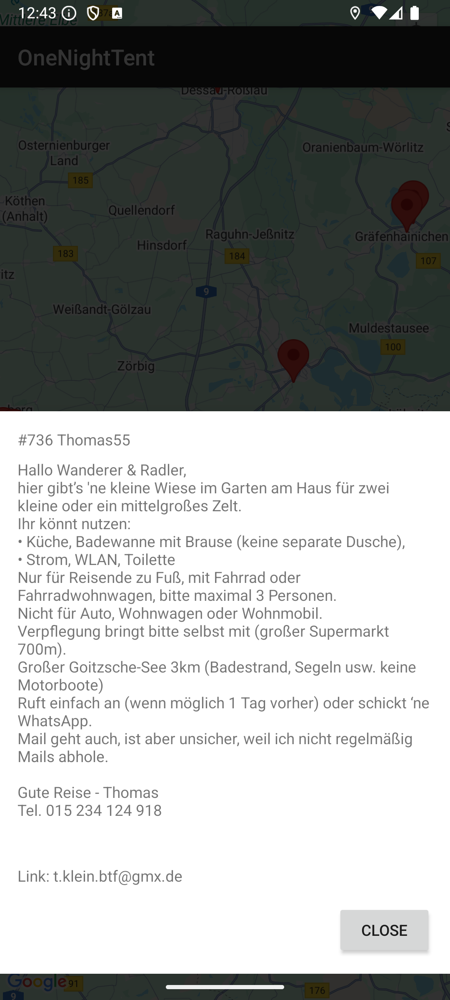

# OneNiteTent - Android Map App

## Overview

OneNiteTent is an Android application designed to help users find and explore tent-friendly locations of [1nitetent](https://1nitetent.com). It displays these locations as markers on a Google Map, providing users with details about each spot.

## Features

- **Interactive Map:** Displays campground locations using Google Maps.
- **Current Location:** Shows the user's current location on the map (requires location permission).
- **Campground Markers:** Places markers on the map for each campground.
- **Detailed Info Windows:** Tapping a marker shows a custom info window with:
  _ Campground Name
  _ Description \* Contact Link/Email
  [

## Screenshots

## Screenshots

|                                         map                                         |                                              marker                                              |
|:-----------------------------------------------------------------------------------:|:------------------------------------------------------------------------------------------------:|
|  |  |

## Setup and Build

1. **Clone the Repository:**
2. **Google Maps API Key:**
    - Obtain a Google Maps API key enabled for the "Maps SDK for Android". Follow the instructions [here](https://developers.google.com/maps/documentation/android-sdk/get-api-key).
    - Create a file named `local.properties` in the root directory of the project (if it doesn't already exist).
    - Add your API key to `local.properties`:

    - **Note:** `local.properties` is included in `.gitignore` and should not be committed to version control.

3. **Open in Android Studio:**

    - Open Android Studio.
    - Select "Open an existing Android Studio project".
    - Navigate to and select the cloned `OneNiteOneTent` project directory.

4. **Sync Gradle:**

    - Android Studio should automatically sync the project with Gradle. If not, go to `File > Sync Project with Gradle Files`.

5. **Build and Run:**
    - Select a target device/emulator.
    - Click the "Run" button (green play icon) in Android Studio.

## License

This project is licensed under the [GNU General Public License v3.0] License - see the [license](LICENSE.md) file (if you create one) for details.
